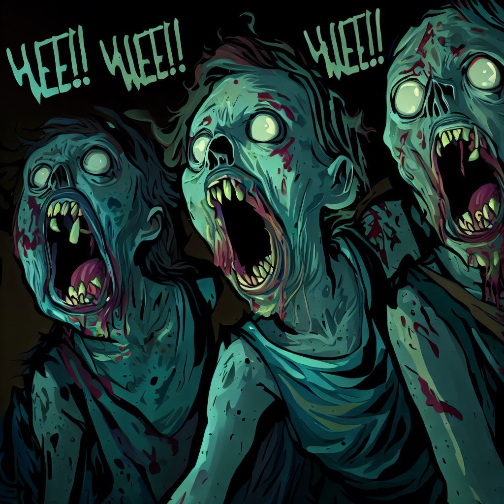

# Zombies
2023 - Coding

## Prompt
"survive..."
#### Attachment

## Process
* binwalk and extract to get two files:
  * Zombies.py
  * contagion.txt
* it appears the odd class structure is taking inputs from rows of the txt file and returning letters based on chr() values as you increment, decrement, or restart a counter... OF BRAINZ
* there are multiple options in the IF statement that are unused.
* comment out the if statement and run.
  * CYHIESOLANGNIGHTMAREE
* I assume the E final character should be }, I add vaccine as the final step on the txt file, rerun
  * CYHIESOLANGNIGHTMARE}
* Given the algorithm is pretty much start at 0, increment, then chr()... we can assume that if there is another E and we reset in the same sequence, we can convert other E's to {}

## Solution
* CYHI{SOLANGNIGHTMARE}