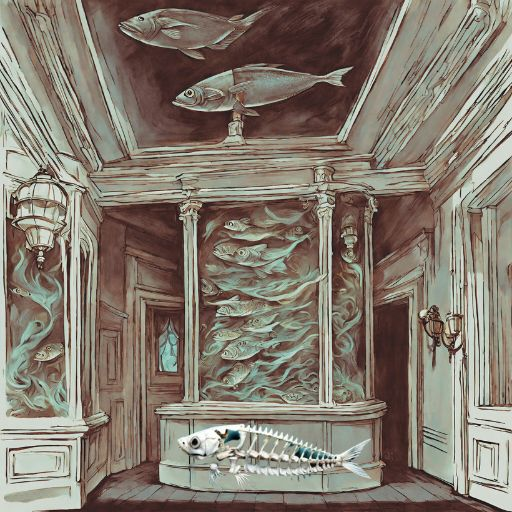

# Aquarium
2023 - Stego

## Prompt
"weird poem, mention of answers revealed through water true..."
#### Attachment

## Process
* `cat aquarium.jpeg` to see a strange eso looking string at end of file
  * oiiiiiiiiiioiiiiiiiiiiiiiiodddddddddddddddodddddoiiiiiiiiiiiiiiiiiiiiiiiiiiiiiiiiiiiiiiiiiiiiiiiiiiiiiiioddddddddddddddddddddddddddddddddddddddddddddoiiiiiiiiiiiiiiiiiiiiiiiiiiiiiiiiiiiiioddddddddddddddddddddddddddddodddddddddddddddddoiiiiiiiiiiiiioiiiiiiiiiiiiiiiiiiiiiiiiiiiiioddddddddddddddddddddddddddddodddddddddddoiiiiiiiiiioiiiiiiiiiiiiiiiiiiiiiiiiiiiiiiiiiiioddddddddddddddddddddddddddddddoiiioddddoiiiiiiiiiiiiiiiiiiiiiiiiiiiiiiiiiodddddddddddddddddddddddddddddddddddddddddddddddddddddddoiiiiiiiiiiiiiiiiiiiiiiiiiiiiiiiiiiiiiiiiiiiiiiiiiioiodddddddddddddddddoiiiiiiiiiiiiiiiiiiiiiioiiisiiiisii
* the image is of a fish skeleton, hinting at the esoteric language dead fish: https://esolangs.org/wiki/Deadfish
* upon review of the esolang, we see that o is the stop character... odd to start with a stop character, right?
    * also can determine through the prompt, that we need to reverse the text, since images are mirrored when looking through water: https://www.dcode.fr/reverse-writing
* take the output and decode from deadfish: https://www.dcode.fr/deadfish-language

## Solution
* CYHI{DeadFishLiveInBytes}