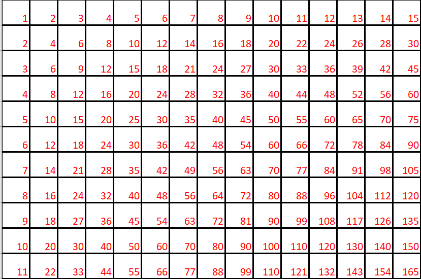
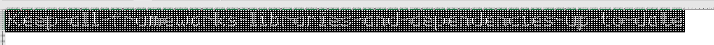

# How to Excel in Excel
2023 - Stego

## Prompt
"something spooky probably"
#### Attachment

## Process
* Excel file has a rectangular grid of values
* 
* some of the cells have functions, so select just those with functions...
* 

## Solution
* CYHI{Keep-all-frameworks-libraries-and-dependencies-up-to-date}